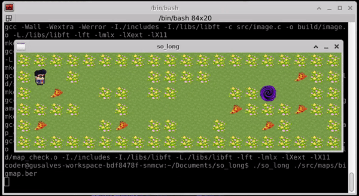

<p align ="center">
	
</p>

<p>
	<h1> so_long </h1>
</p>

<p>
	O so_long tem como objetivo criar um joguinho 2D usando a MinilibX (uma API de programação X-Window (X11R6) simples em C).
</p>

<p>
	<h2> Pontuação </h2>
</p>
<p>
	
</p>

<p>
	<h2> O jogo</h2>
</p>

<p align ="center">
	
</p>

<p>
	Para jogar, siga as instruções:
</p>

```bash
# Clone o projeto e entre na pasta
git clone https://github.com/gustavdlima/so_long.git && cd so_long/

# Digite make para criar o executável
make

# Execute o programa (na pasta src/maps/, estão os mapas disponíveis)
./so_long ./src/maps/bigmap.ber

# PARA MOVIMENTAR O PLAYER USE -> W A S D

# Feche o jogo com
ESC

# Limpe os objetos criados com
make fclean

# Fim!
```
